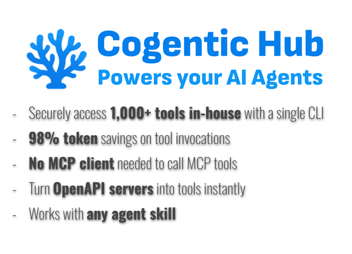
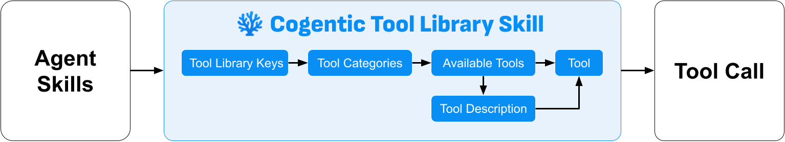

# Cogentic Platform - 万级私有AI工具库治理平台

**解决MCP三大痛点**：
- Token
- 认证
- 访问

## 核心能力：
1. 支持AI Agent从任何地方都可以渐进式访问万级企业私有工具库
   - CLI方式
   - HTTP API方式
2. 统一管理万级企业私有工具库(Tool Libraries)
   - 工具源(Tool Endpoint)管理
     * MCP Server
     * OpenAPI
   - 工具注册
   - 工具编排 (Tool Orchestration)：按需编排不同工具源的工具，形成新的虚拟工具源
   - 工具授权：授权AI Agent访问选定的工具或工具源
3. 工具调用：AI Agent可以访问到任何网络环境中已注册的私有工具
4. 在团队中分享工具：将工具源分享给团队，团队成员可以在自己的AI Agent中使用这些工具

## 优势亮点：

1. AI Agent可以通过Cogentic Hub CLI访问到用户所有已注册的工具
   - 使用不同的Key可以访问到不同的工具集
   - 直接访问MCP工具，无需MCP Client支持
   - 支持Http API方式调用
2. 支持工具渐进式披露
   - 自定义工具分类，更加节省Token
   - 实现动态Skill，随时按需更新工具
   - 从万级工具池中找到目标工具，平均仅需 1000 Token。
3. 团队协作：在团队中分享工具
4. 任意部署，随处访问：用户可以在任何环境部署私有工具，AI Agent可以在任何环境访问到这些工具

## 主要部件：

1. Cogentic Platform
   - Cogentic Hub：管理工具及团队分享
   - Cogentic Link：连接AI Agent及工具调用
   - Cogentic Router：建立AI Agent与工具间的连接，完成工具调用
2. Cogentic CLI：AI Agent可以直接使用活在Skill中使用
3. Cogentic Hub：连接私有工具并注册到Cogentic Hub；与Cogentic Router一起建立AI Agent与工具间的连接，完成工具调用
   - 用户可以在不同环境安装多个Cogentic Hub，每个Cogentic Hub都可以连接不同的工具源
   - AI Agent可以通过CLI访问到任何一个Cogentic Hub上连接的工具

## 工具渐进式披露流程
支持AI Agent渐进式访问万级企业私有工具库

## 与其他MCP CLI对比

||Cogentic Hub|其他MCP CLI|
|-|-|-|
|安装方式|无需安装|需要与AI Agent安装在同一环境|
|工具部署|无限制|stdio类型的MCP server，必须与CLI安装在同一环境|
|OpenAPI工具|原生支持|需要第三方支持|
|本地访问|支持|支持|
|互联网访问|支持 - AI Agent可以在任何网络环境访问到所有已注册的工具|不支持|
|工具原子性|支持 - 任何工具源的工具都可以单独披露|不支持 - 已MCP server为单位，披露全部工具|
|工具编排|支持 - 可根据使用需求及场景，编排不同工具源的工具，形成新的虚拟工具源 - 甚至是其他用户工具源的工具|不支持|
|工具渐进式披露|支持 - 工具池->工具分类->工具|不支持|
|工具访问授权|支持 - 每一个工具都可以单独授权访问|不支持|
|工具分享|支持 - 可在团队中安全分享工具|不支持|

## 产品
||社区版|企业版|云服务版|
|-|-|-|-|
|费用|免费|收费|有限免费/按量收费|
|安装环境|私有网络|企业网络|无需安装|
|账号|无|企业管理|需注册账号|
|工具组网|手动配置|无需配置|无需配置|
|工具源部署|私有|私有|私有/云端免部署|
|访问|私有网络|企业网络|互联网|